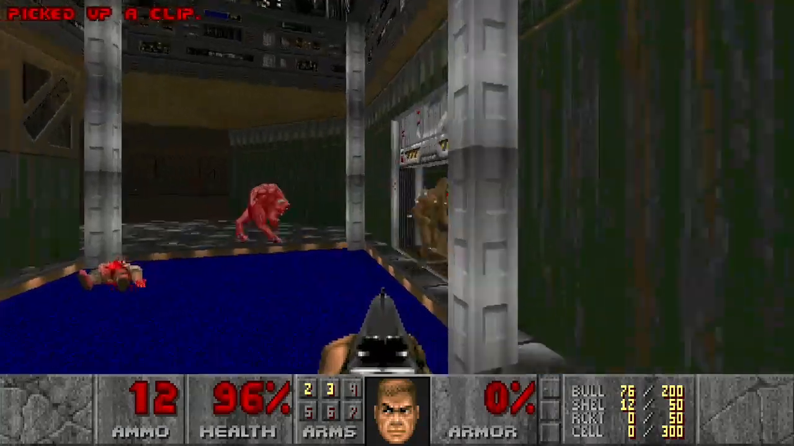
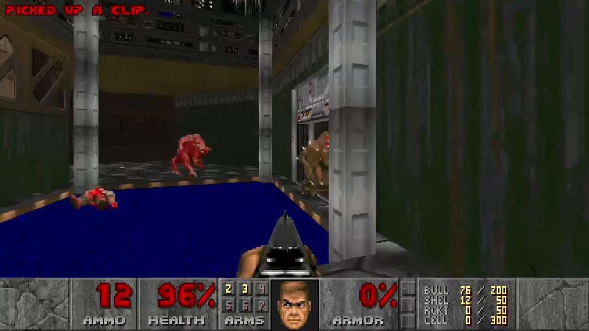

Original size:
26M Doom.mkv

Screenshot:
```bash
ffmpeg -i Doom.mkv -vf "select=eq(n\,500)" -vframes 1 -y Doom.png
```

#### Comparison

| №        | Picture                                                           |
|----------|-------------------------------------------------------------------|
| original |                                         |
| standard |                                |
| 1        |  |
| 2        |                      |
| 3        |  |

#### libvpx-vp9

| № | crf | deadline | row-mt | cpu-used | size | time          |
|---|-----|----------|--------|----------|------|---------------|
| 1 | 31  | good     | 1      | 2        | 28M  | 4m 14s 894ms  |
| 2 | 31  | good     | -      | -        | 28M  | 8m 9s 422ms   |
| 3 | 31  | best     | 1      | 2        | 27M  | 38m 33s 916ms |

### 1. Multithread:

```bash
ffmpeg -i Doom.mkv -y -acodec aac -vcodec libvpx-vp9 -row-mt 1 -cpu-used 2 -f null -movflags faststart -pix_fmt yuv420p -channel_layout stereo -b:a 256k -vf scale=w=-2:h=720 -deadline good -pass 1 -b:v 0 -r 30 -crf 31 /dev/null &&
ffmpeg -i Doom.mkv -y -acodec aac -vcodec libvpx-vp9 -row-mt 1 -cpu-used 2 -f mp4 -movflags faststart -pix_fmt yuv420p -channel_layout stereo -b:a 256k -vf scale=w=-2:h=720 -deadline good -r 30 -pass 2 -b:v 0 -crf 31 Doom-vp9-dl_good-row_mt_1-cpu_used_2-crf_31.mp4
```

### 2. Singlethread

```bash
ffmpeg -i Doom.mkv -y -acodec aac -vcodec libvpx-vp9 -f null -movflags faststart -pix_fmt yuv420p -channel_layout stereo -b:a 256k -vf scale=w=-2:h=720 -deadline good -pass 1 -b:v 0 -r 30 -crf 31 /dev/null &&
ffmpeg -i Doom.mkv -y -acodec aac -vcodec libvpx-vp9 -f mp4 -movflags faststart -pix_fmt yuv420p -channel_layout stereo -b:a 256k -vf scale=w=-2:h=720 -deadline good -r 30 -pass 2 -b:v 0 -crf 31 Doom-vp9-dl_good-crf_31.mp4
```

### 3. Multtthread best

```bash
ffmpeg -i Doom.mkv -y -acodec aac -vcodec libvpx-vp9 -row-mt 1 -cpu-used 2 -f null -movflags faststart -pix_fmt yuv420p -channel_layout stereo -b:a 256k -vf scale=w=-2:h=720 -deadline best -pass 1 -b:v 0 -r 30 -crf 31 /dev/null &&
ffmpeg -i Doom.mkv -y -acodec aac -vcodec libvpx-vp9 -row-mt 1 -cpu-used 2 -f mp4 -movflags faststart -pix_fmt yuv420p -channel_layout stereo -b:a 256k -vf scale=w=-2:h=720 -deadline best -r 30 -pass 2 -b:v 0 -crf 31 Doom-vp9-dl_best-row_mt_1-cpu_used_2-crf_31.mp4
```
